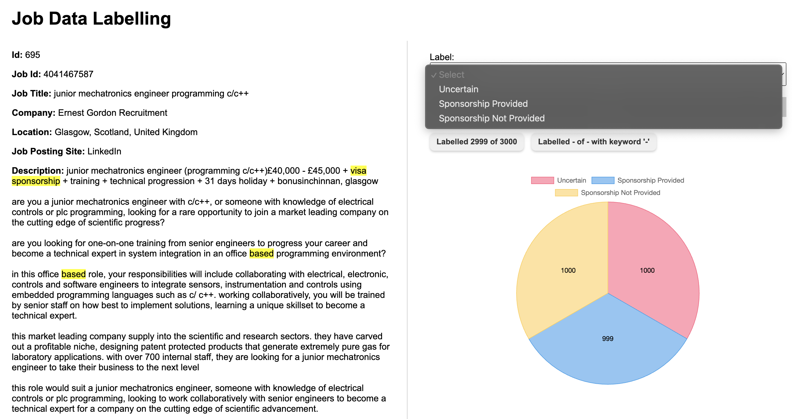

# Job Sponsorship Predictor

A full-stack AI-powered job search platform that scrapes job listings, predicts visa sponsorship likelihood using a machine learning model, and displays filtered results through a modern Angular frontend.

## Live Demo

- **Frontend:** Hosted on GitHub Pages
- **Backend API:** Hosted on Render
- **Database & Scheduler:** Powered by Railway

## Features

- Automatically scrapes job listings every 24 hours using [JobSpy](https://pypi.org/project/jobspy/)
- Uses a trained text classification model to predict sponsorship likelihood
- Stores job data in a MySQL database
- Deletes jobs older than 3 months daily
- Search and filter by keyword, location, and job posting duration
- Clean and fast frontend using Angular
- REST API built with Flask

## Data Collection and Labeling

- **Data Scraping**: Job listings were scraped using the [JobSpy](https://pypi.org/project/jobspy/) Python package.
- **Labeling Tool**: A custom labeling interface was built using Flask (with both frontend and backend components) to manually annotate job listings for visa sponsorship status. These labeled examples were used to train the prediction model.

## Tech Stack

- **Frontend:** Angular, TypeScript, GitHub Pages
- **Backend:** Flask (Python), hosted on Render
- **Machine Learning:** Scikit-learn model (trained using job descriptions)
- **Database:** MySQL, hosted on Railway
- **Scheduler** Railway Cron Jobs (for scraping & cleanup) using Python
- **Scraping:** JobSpy

## Getting Started

### Backend

1. **Clone the repository**
   ```bash
   git clone https://github.com/your-username/your-repo-name.git
   cd your-repo-name/backend
2. **Install Dependencies**
   ```bash
   pip install -r requirements.txt
3. **Set Environment Variables**
   ```bash
   MYSQL_USER=your_user
   MYSQL_PASSWORD=your_password
   MYSQL_HOST=your_host
   MYSQL_DB=your_db
4. **Run the Flask Server**
   ```bash
   flask run

### Running the Daily Job Scraper (schedule.py)

The file schedule.py, located in the job_search_backend/ directory, is responsible for automating the following tasks:

   1. Scraping new job listings using JobSpy
   2. Running the machine learning model to predict sponsorship likelihood
   3. Storing results in the database
   4. Removing job listings older than 90 days

To run this script daily, set up a cron job (or use the appropriate task scheduler for your system or deployment platform).


### Frontend

1. **Navigate to the frontend directory**

   ```bash
    cd ../frontend

2. **Install dependencies**

    ```bash
    npm install

3. **Update the backend API URL in environment.ts**

4. **Build and deploy to GitHub Pages**

    ```bash
    ng build --configuration production
    npx angular-cli-ghpages --dir=dist/your-project-name

## Model Training
The machine learning model was trained in two notebooks:

  - **data-exploration.ipynb** – for preprocessing and feature analysis
  
  - **text_classification_model.ipynb** – for model training and evaluation

The model predicts whether a job description implies visa sponsorship based on keywords and textual features.
The data collection process began with scraping job listings using the JobSpy Python package. Each listing typically included fields such as job title, company name, location, full description, and posting date. Since the sponsorship status is not usually provided explicitly by job boards, a custom-built labeling tool—developed with Flask—was created to allow manual annotation. Each job was reviewed and labeled as either “sponsorship provided”, “no sponsorship provided” and "uncertain" based on the presence of key phrases (such as “visa sponsorship available” or “must be authorized to work”) and contextual language in the description.



Before training, the text data underwent preprocessing in a Jupyter notebook (data-exploration.ipynb). This involved lowercasing, punctuation removal, stopword filtering, and tokenization. A TF-IDF (Term Frequency–Inverse Document Frequency) vectorizer was then used to transform the cleaned job descriptions into numerical representations that could be used as input features for model training.

Model training and evaluation were carried out in a separate notebook (text_classification_model.ipynb). Several traditional classifiers were tested, including Naive Bayes, Random Forest, and Logistic Regression. Among these, Logistic Regression yielded the best balance of accuracy of around 95% and interpretability. The model’s performance was evaluated using standard classification metrics like accuracy, precision, recall, and F1-score, with special attention paid to its ability to correctly identify sponsorship-relevant listings. 

Once trained, the final model was saved using joblib and integrated into the backend API. During the automated scraping process, each new job listing is passed through this model to infer its sponsorship likelihood, and the result is stored in the database.

## Automation Tasks

 - **Daily scraping & inference:** Using a scheduler or cron, the backend:
  
- Fetches new jobs via JobSpy
  
- Applies the ML model to predict sponsorship
  
- Stores the results in the MySQL DB
  
- **Daily cleanup:** Jobs older than 3 months are automatically removed

